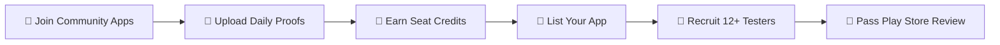

# ⚡ Tester Exchange

### *Reciprocal 14-Day Closed Testing Platform for Android Developers*

 

> 🚀 **Pass Google Play Console's mandatory 20-tester / 14-day closed testing requirement effortlessly through developer reciprocity.**

[📥 **Download Latest APK (v1.0.0)**](https://github.com/wireforgestudio/Tester_Exchange_Releases/releases/latest) • [🐞 Report Issue](https://github.com/wireforgestudio/Tester_Exchange_Releases/issues) • [📖 Release Notes](https://github.com/wireforgestudio/Tester_Exchange_Releases/releases)

---

## 📌 What is Tester Exchange?

Google Play Console requires all personal developer accounts created after November 2023 to run a **Closed Test track with at least 12–20 opt-in testers for 14 consecutive days** before applying for Production Access.

**Tester Exchange** is a community-driven, reciprocal platform where Android developers help each other pass closed testing. 
- **Test Other Apps ➔ Earn Seat Credits**
- **Spend Seat Credits ➔ Recruit 12+ Verified Community Testers for Your App**

---

## 🔄 How It Works (Step-by-Step Workflow)

### 1️⃣ Step 1: Browse & Join Community Testing
- Explore the **Marketplace** of Android developer apps needing closed testers.
- Filter by category (*Productivity, Utilities, Games, Tools, Lifestyle*).
- Tap any app to view its **Google Play Testing Workflow**.

### 2️⃣ Step 2: Complete 3-Step Opt-in & Daily Proofs
- **Step 1: Join Google Group** — Tap the direct card to join the app's Google Group for Play Store access.
- **Step 2: Opt-in on Google Play** — Tap to accept the closed testing invitation on Google Play.
- **Step 3: Upload Screenshot Proof** — Attach an installation screenshot. Your application goes to **Pending Approval** by the developer.

### 3️⃣ Step 3: Earn Seat Credits & Streaks
- Test apps daily for 14 consecutive days.
- **1 Day Tested = 1 Seat Credit Earned**.
- Track your active testing streak, earned credits, and achievement badges on your profile dashboard.

### 4️⃣ Step 4: List Your App & Recruit Testers
- Use your earned **Seat Credits** to register your own Android app.
- Set your required **Tester Target** (e.g. 12 or 20 testers).
- Review and approve incoming community tester screenshot proofs from your **My Apps** developer dashboard.

### 5️⃣ Step 5: Export Verified Testers to Google Play
- Export your verified list of 14-day testers for submission to Google Play Console with 100% confidence!

---

## 📱 App Highlights & Visual Features

| Feature | Description |
| :--- | :--- |
| **🛡️ Double-Bezel Architecture** | Modern hardware-inspired card enclosures with dark & light theme contrast guardrails. |
| **💎 Ecosystem Seat Engine** | Real-time seat balance calculations with animated count transitions and transaction audit log. |
| **🔒 Developer Review Lock** | Application CTA automatically locks in *"⏳ Awaiting Developer Approval"* state until proof is verified. |
| **⚡ Quick Start Mode** | Includes instant Developer Quick Start for testing on Android emulators and offline environments. |
| **🌙 Adaptive Dark/Light Mode** | HSL-tailored Obsidian Midnight (`#0B0F17`) and Pristine Slate (`#F8FAFC`) visual design system. |

---

## 📦 Download & Installation

### System Requirements
- **Operating System**: Android 8.0 (Oreo / API Level 26) or higher
- **Storage**: ~15 MB free space
- **Permissions**: Internet, Camera (for screenshot proof capture), Storage

### Quick Installation Guide

1. **Download APK**: Tap below to download `TesterExchange-v1.0.0.apk`:
   
   👉 [**Download TesterExchange-v1.0.0.apk**](https://github.com/wireforgestudio/Tester_Exchange_Releases/releases/latest)

2. **Allow Installation**:
   - Open the downloaded `.apk` file on your device.
   - If prompted, enable **"Install from unknown sources"** for your browser/file manager.

3. **Launch App**:
   - Open **Tester Exchange**, tap `⚡ Developer Quick Start (Demo)` or `Continue with Google`, and start testing!

---

## 🛡️ Security & Privacy Assurance

- **HTTPS Network Security**: Enforced via `network_security_config.xml` (cleartext traffic disabled).
- **Non-Root Backup Guard**: Configured `allowBackup="false"` to prevent local app data tampering.
- **Offloaded I/O Execution**: All bitmap processing and network requests run safely on `Dispatchers.IO`.

---

### Built with ❤️ by Android Developers, for Android Developers.

[⬆️ Back to Top](#-tester-exchange)

