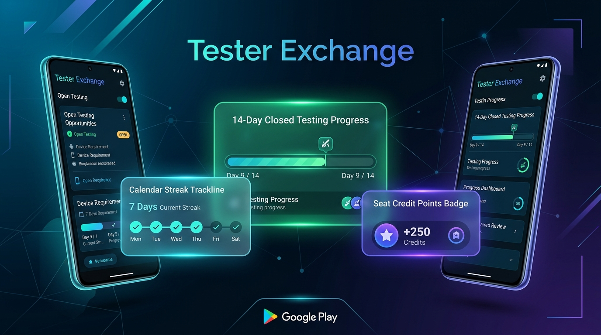
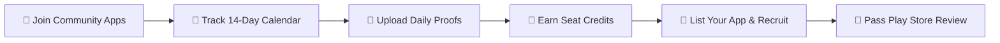

# ⚡ Tester Exchange

### *Reciprocal 14-Day Closed Testing Platform for Android Developers*

 

> 🚀 **Pass Google Play Console's mandatory 20-tester / 14-day closed testing requirement effortlessly through developer reciprocity.**

[📥 **Download Production APK (v2.2.0)**](https://github.com/wireforgestudio/Tester_Exchange_Releases/releases/download/v2.2.0/TesterExchange-v2.2.0.apk) • [📖 Full Release Notes](https://github.com/wireforgestudio/Tester_Exchange_Releases/releases/tag/v2.2.0) • [🐞 Report Issue](https://github.com/wireforgestudio/Tester_Exchange_Releases/issues)

---

## 📌 What is Tester Exchange?

Google Play Console requires all personal developer accounts created after November 2023 to run a **Closed Test track with at least 12–20 opt-in testers for 14 consecutive days** before applying for Production Access.

**Tester Exchange** is a community-driven, reciprocal platform where Android developers help each other pass closed testing. 
- **Test Other Developers' Apps ➔ Earn Seat Credits (+1 per Day Tested)**
- **Spend Seat Credits ➔ Recruit 12+ Verified Community Testers for Your App**

---

## 🔄 How It Works (Step-by-Step Workflow)

### 1️⃣ Step 1: Browse & Join Community Testing
- Explore the **Marketplace** of Android developer apps needing closed testers.
- Filter by category (*All, Needs Testers, Finished / Completed*).
- Tap any app to view its **Google Play Testing Workflow**.

### 2️⃣ Step 2: Complete 3-Step Opt-in & Daily Proofs
- **Step 1: Join Google Group** — Tap the direct link card to join the app's Google Group for Play Store access.
- **Step 2: Opt-in on Google Play** — Tap to accept the closed testing invitation on Google Play.
- **Step 3: Upload Screenshot Proof** — Attach an installation screenshot. Your application goes to **Pending Approval** by the developer.

### 3️⃣ Step 3: Track 14-Day Calendar & Earn Seat Credits
- View your **14-Day Installed Date Trackline** featuring real-time calendar dates (e.g. `Jul 15` ➔ `Jul 29`).
- Tap any day chip on the calendar trackline to view or upload screenshot proof.
- **1 Day Tested = +1 Seat Credit Earned**.

### 4️⃣ Step 4: List Your App & Recruit Testers
- Spend your earned **Seat Credits** to register your own Android app.
- Set your required **Tester Target** (e.g. 12 or 20 testers).
- Review incoming community tester screenshot proofs from your **My Apps** developer dashboard.
- **Pause & Finish**: Pause or Mark testing as Finished (`FINISHED 🎉`) anytime with 1 tap.

### 5️⃣ Step 5: Export Verified Testers to Google Play
- Export your verified list of 14-day testers for submission to Google Play Console with 100% confidence!

---

## 📱 Core Features & Architectural Highlights

| Feature | Description |
| :--- | :--- |
| **📅 14-Day Installed Date Trackline** | Calculates exact installation date and 14-day completion target date with day-by-day dates (`Jul 15` ➔ `Jul 29`). |
| **📸 Screenshot Proof Lightbox** | Tap any screenshot thumbnail to open full-screen picture preview. |
| **💎 Automated Seat Point Engine** | Real-time seat balance calculations (`Earned - Spent = Available`) with transparent transaction history. |
| **🏁 Mark as Finished & Pause Modes** | 1-tap toggle to mark testing as finished (`FINISHED 🎉`) or paused while preserving full app history. |
| **🎨 Status Badge Alignment** | Clean single status badge (`ACTIVE` / `PAUSED` / `TARGET REACHED` / `FINISHED 🎉`) positioned on the bottom right under action buttons. |
| **🔑 Production Keystore Signed** | Digitally signed with RSA 2048-bit key certificate valid for 25+ years. |
| **🔒 Enterprise Security** | Enforced HTTPS-only network security, non-root backup protection (`allowBackup="false"`), and R8 obfuscation. |

---

## 📦 Download & Installation

### System Requirements
- **Operating System**: Android 8.0 (Oreo / API Level 26) or higher
- **Storage**: ~15 MB free space
- **Permissions**: Internet, Camera (for screenshot proof capture), Storage

### Installation Steps

1. **Download APK**: Download `TesterExchange-v2.2.0.apk`:
   
   👉 [**Download TesterExchange-v2.2.0.apk**](https://github.com/wireforgestudio/Tester_Exchange_Releases/releases/download/v2.2.0/TesterExchange-v2.2.0.apk)

2. **Allow Installation**:
   - Open the downloaded `.apk` file on your device.
   - Enable **"Install from unknown sources"** if prompted by your browser or file manager.

3. **Launch App**:
   - Open **Tester Exchange**, sign in with Google, and start testing community apps to earn seat credits!

---

## 🔒 Security & Privacy Assurance

- **HTTPS Network Security**: Enforced via `network_security_config.xml` (cleartext traffic disabled).
- **Non-Root Backup Guard**: Configured `allowBackup="false"` to prevent local app data tampering.
- **Offloaded I/O Execution**: All bitmap processing and network requests run safely on `Dispatchers.IO`.

---

### Built with ❤️ by Android Developers, for Android Developers.

[⬆️ Back to Top](#-tester-exchange)

